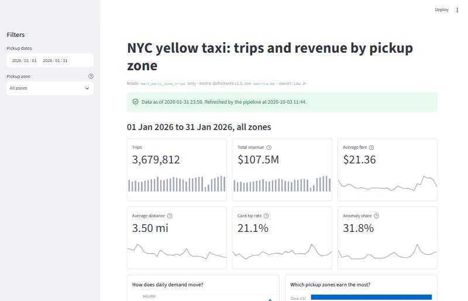
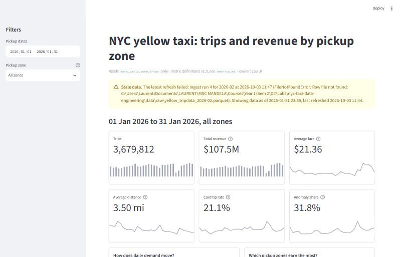
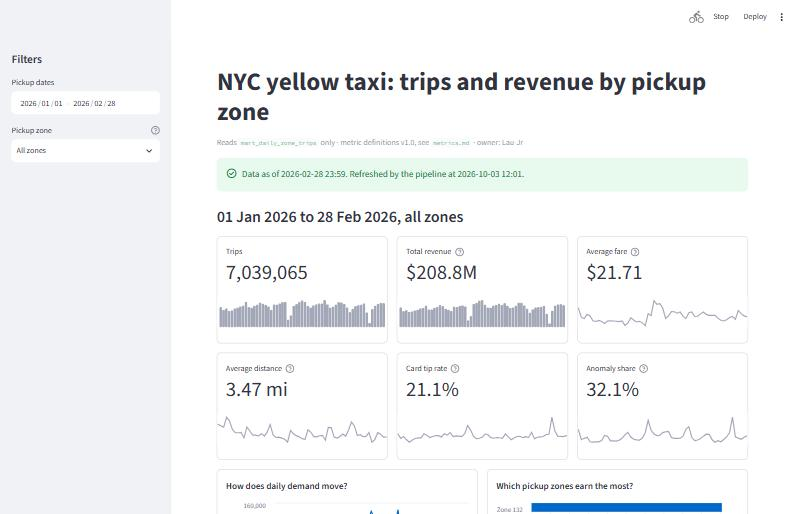
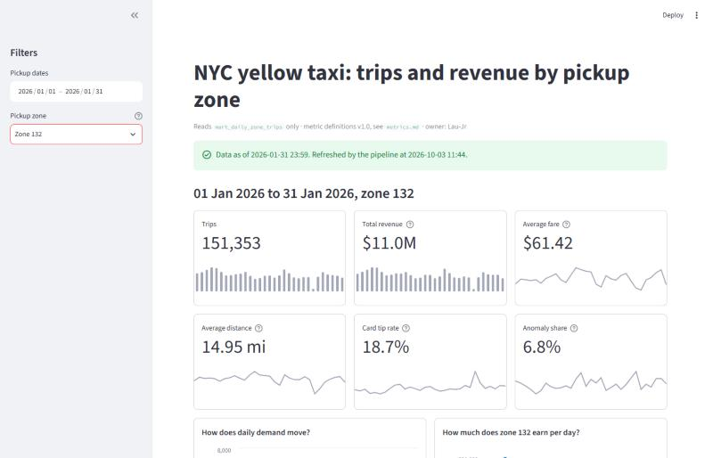

# Phase 7 — Open one clean tap

| Lab requirement | Where |
|---|---|
| One curated output table, named, documented, refreshed by the pipeline | `mart_daily_zone_trips`: [`sql/07_refresh_mart_daily_zone_trips.sql`](../../sql/07_refresh_mart_daily_zone_trips.sql), rebuilt by `src/ingest.py` after every successful run |
| Metric definitions: formula, grain, filters, owner | [`metrics.md`](../../metrics.md), implemented only in [`src/metrics.py`](../../src/metrics.py) |
| One consumer view | [`streamlit_app.py`](../../streamlit_app.py) (`streamlit run streamlit_app.py`) |
| Freshness label computed from the data, broken on purpose | [`src/serving.py::get_freshness`](../../src/serving.py) and `pipeline_run` ([`sql/06`](../../sql/06_create_pipeline_run.sql)); sections 2–4 below |

## 1. The published table reconciles with the warehouse

After the January replay (`python -m src.ingest --month 2026-01`, pipeline run 2):

```
SELECT COUNT(*), SUM(total_amount) FROM fact_trip;                        -- 3,679,812 · $107,534,737.50
SELECT SUM(trip_count), SUM(total_revenue) FROM mart_daily_zone_trips;    -- 3,679,812 · $107,534,737.50
SELECT COUNT(*) FROM mart_daily_zone_trips;                               -- 7,546 (31 days × 262 zones observed)
```

The replay inserted 0 rows into `fact_trip` and quarantined 0 new rows. The mart was
rebuilt with 7,546 rows. Zone 132 in the mart (151,353 trips, $10,959,150.46) matches the
`fact_trip` figure traced in the README's lineage section, so the serving layer adds no
drift of its own. `tests/test_serving.py::test_mart_reconciles_with_fact_trip` asserts the
same reconciliation on every test run, and `test_mart_refresh_is_idempotent` shows that a
second rebuild gives identical rows.

## 2. Freshness promise and how the label is computed

**Promise:** the mart reflects every month that has been ingested successfully. It is
rebuilt by the pipeline at the end of each successful ingest run.

The label is never typed by hand. `get_freshness` computes it on every page load from:

| Shown | Computed from |
|---|---|
| "Data as of …" | `MAX(last_pickup_datetime)` in `mart_daily_zone_trips` (the latest trip actually in the data) |
| "Refreshed by the pipeline at …" | `MAX(refreshed_at)` in the mart, bound by `database.refresh_marts` at rebuild time |
| Green or amber | the latest row of `pipeline_run`: **amber** if it is `failed`, or if it has been `running` for more than 2 hours (it crashed without recording a result); **green** otherwise |

The dashboard caches the mart per `refreshed_at` value, so a rebuild invalidates the cache
by itself. The freshness query is never cached.

## 3. Break the refresh on purpose

Scenario: TLC's February file does not arrive upstream. The file was held back (renamed)
and the pipeline was run as usual:

```
mv data/raw/yellow_tripdata_2026-02.parquet data/raw/yellow_tripdata_2026-02.parquet.held_back
python -m src.ingest --month 2026-02
...
ERROR Ingestion FAILED (pipeline_run 4): FileNotFoundError: Raw file not found: ...\yellow_tripdata_2026-02.parquet
```

**Before**, after the January replay (green):



**After** the failed February run (amber). The numbers are still January's, and the banner
says so, names the failed run and its error, and gives the last good refresh:



`pipeline_run` at this point:

| run_id | month | status | started | finished | rows_inserted | mart_rows | error |
|---:|---|---|---|---|---:|---:|---|
| 1 | 2026-01 | success | 2026-10-03 11:23 | 11:34 | 0 | 7,546 | |
| 2 | 2026-01 | success | 2026-10-03 11:36 | 11:45 | 0 | 7,546 | |
| 3 | 2026-02 | **failed** | 2026-10-03 11:47 | 11:47 | | | `FileNotFoundError('Raw file not found: …')` |
| 4 | 2026-02 | **failed** | 2026-10-03 11:47 | 11:47 | | | `FileNotFoundError: Raw file not found: …` |

(Run 1 published the mart for the first time. Run 2 republished it after the
`avg_trip_distance` definition changed; see section 5. Runs 3 and 4 are the same failure. Run 3 stored the error as a Python `repr`, with
doubled backslashes in the path. That was hard to read in the banner, so the stored
format was changed to `Type: message` and the failure was repeated.)

## 4. Fix upstream and replay

The file was restored and the same command was run again:

```
mv data/raw/yellow_tripdata_2026-02.parquet.held_back data/raw/yellow_tripdata_2026-02.parquet
python -m src.ingest --month 2026-02
```

```
INFO Rows quarantined (new this run): 40,613
INFO Rows inserted: 3,359,253
INFO fact_trip row count after run: 7,039,065
INFO mart_daily_zone_trips refreshed: 14,384 rows
INFO Ingestion completed
```

The run was recorded as `| 5 | 2026-02 | success | 2026-10-03 11:48 | 12:02 | 3,359,253 | 14,384 | |`.
The banner turned green again with **data as of 2026-02-28 23:59**, without anyone editing
a label. The mart still reconciles: 7,039,065 trips and $208,839,100.46 in both
`fact_trip` and `mart_daily_zone_trips`.



The same break-and-recover cycle runs on every test run in
`tests/test_serving.py::test_failed_run_turns_freshness_stale_then_recovers`, and through
the real dashboard in `test_dashboard_shows_the_freshness_label`, which uses Streamlit's
`AppTest`. A run stuck in `running` is covered by `test_run_stuck_in_running_is_stale`.

## 5. Dashboard hygiene: what the view was weakest on

| Rule | How the view applies it |
|---|---|
| Know the audience | An operations analyst for the yellow-cab fleet: city-wide trend first, then a zone. |
| One question per view | Each panel is titled with its question: "How does daily demand move?", "Which pickup zones earn the most?" (or "How much does zone N earn per day?" after drilling in). |
| Show freshness | A computed banner at the top of every view (sections 2–4). |
| Offer a drill path | Whole city → one pickup zone (sidebar) → that zone's daily detail table. Dates filter every level. Zone 132 below: 151,353 trips, the same figure as the README lineage trace. |
| Cut the junk | No pies, gauges or 3-D. Sparklines carry each KPI's daily trend; bars are sorted. |
| Trust the source | The page reads only the mart and `pipeline_run`. Every number comes from `src/metrics.py`, so it matches `metrics.md`. |



**Weakest: know the audience.** Zones are shown as TLC ids ("Zone 132"), because no
zone-name lookup ships with this dataset and `dim_location` has no names. An analyst can
work with that; a manager would need "JFK Airport". The fix belongs in the pipeline, not
the chart: load TLC's taxi zone lookup into `dim_location` and add the name to the mart,
so every consumer gets it at once.

**What changed while building it:**
- The first version put six KPIs in one row, which truncated revenue ("$107,534,…") and
  left one card on a row of its own. It is now two rows of three, with compact money
  ("$107.5M", exact value in the tooltip).
- The bar chart's axis labels were swapped.
- The freshness banner printed the error with escaped backslashes (section 3).

**What defining the metrics changed:** the average-distance KPI first showed **6.73 mi**.
Checking that number found 161 trips over 100 miles (up to 269,098 mi) holding 48% of all
recorded miles. The metric now uses `0 < trip_distance <= 100` (**3.50 mi**), documented
in `metrics.md`. Without one written definition, every chart would have shown its own
version of that number.
